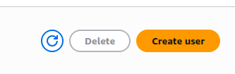
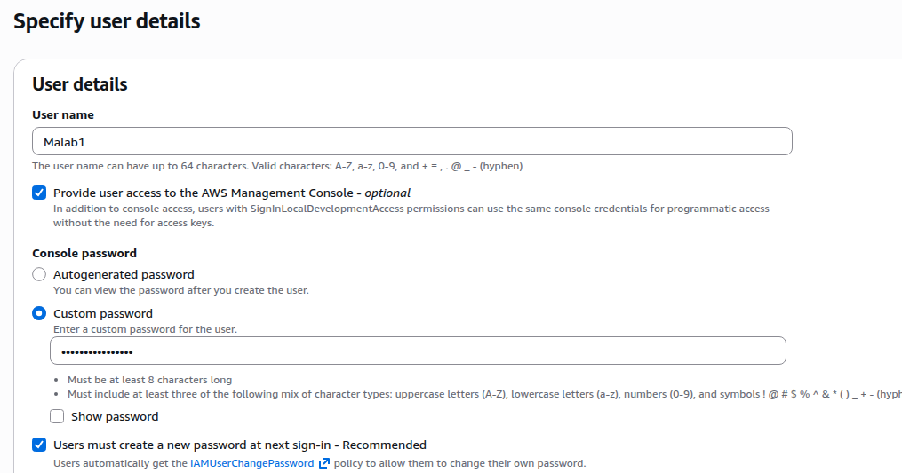
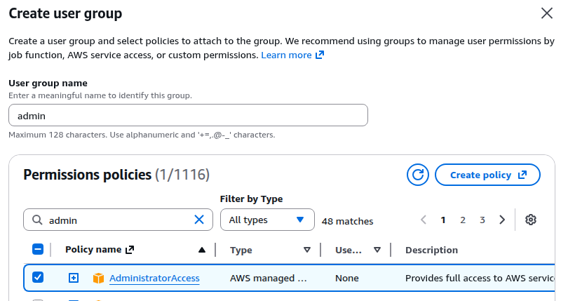
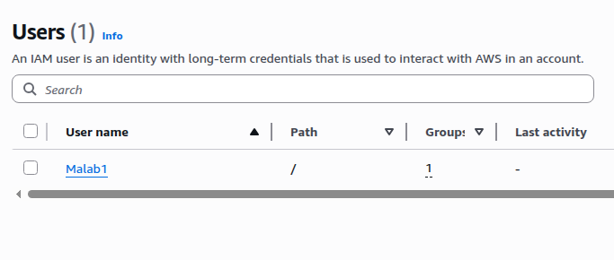

# Create IAM user with admin permissions
In aws its highly recommended to use IAM accounts for essential tasks and avoid using the root user account unless necessary. Steps taken to create an IAM user account with admin permissions are as follows;

  
   
  <i>Clicking on create user button</i>

  
   
  <i>Filling out user details</i>

  
   
  <i>Set admin policy for our new IAM user</i>

  
   
  <i>User account has been created</i>

