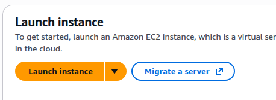
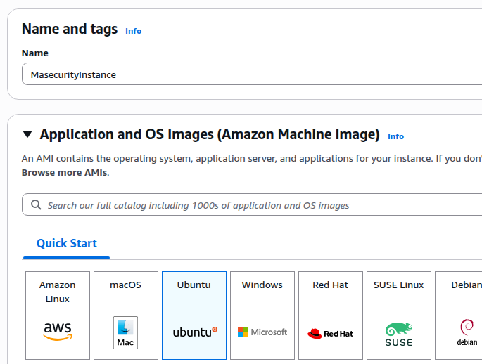
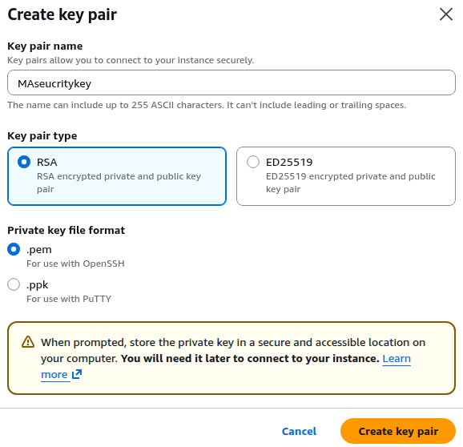
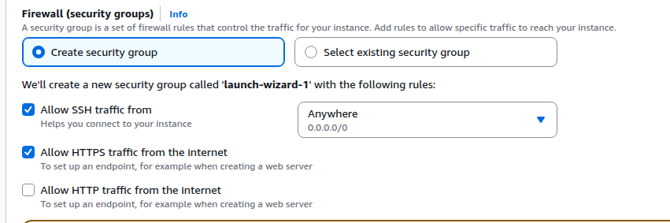
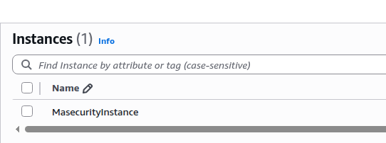

# Create a EC2 instance and run a web server
##  What is EC2 ?
EC2 is a web service provided by aws that allows you to ultilize resizable vitual servers on demand. You can
choose the type of operating system , hardware specs etc. the benefits of utilizing these services is that you 
only play for what you consume thus saving you costs.
<p align="center">
  
  <br>
  <i>Clicking on Launch instance button</i>
</p>
<p align="center">
  
  <br>
  <i>Selecting ubuntu instance type</i>
</p>
<p align="center">
  
  <br>
  <i>Creating the key pair for secure ssh access needed later for the instance</i>
</p>
<p align="center">
  
  <br>
  <i>Configure network settings to allow ssh and https connections</i>
</p>
<p align="center">
  
  <br>
  <i>Instance was created</i>
</p>
 
 ## To make sure your private key is not publicly viewable enter the following command
 ```bash
 chmod 400 "MAseucritykey.pem"
 ```
 ## Connect to your instance via ssh
 ```bash
 ssh -i "MAseucritykey.pem" ubuntu@[PUBLIC DNS]
 ```
 ## Enter these commands to launch web server
 ```bash
 # 1. Update the local package index
sudo apt update -y

# 2. Install Apache2
sudo apt install apache2 -y

# 3. Start the service
sudo systemctl start apache2

# 4. Enable Apache to start automatically on boot
sudo systemctl enable apache2

# 5. (Optional) Check the status to ensure it is running
sudo systemctl status apache2
```